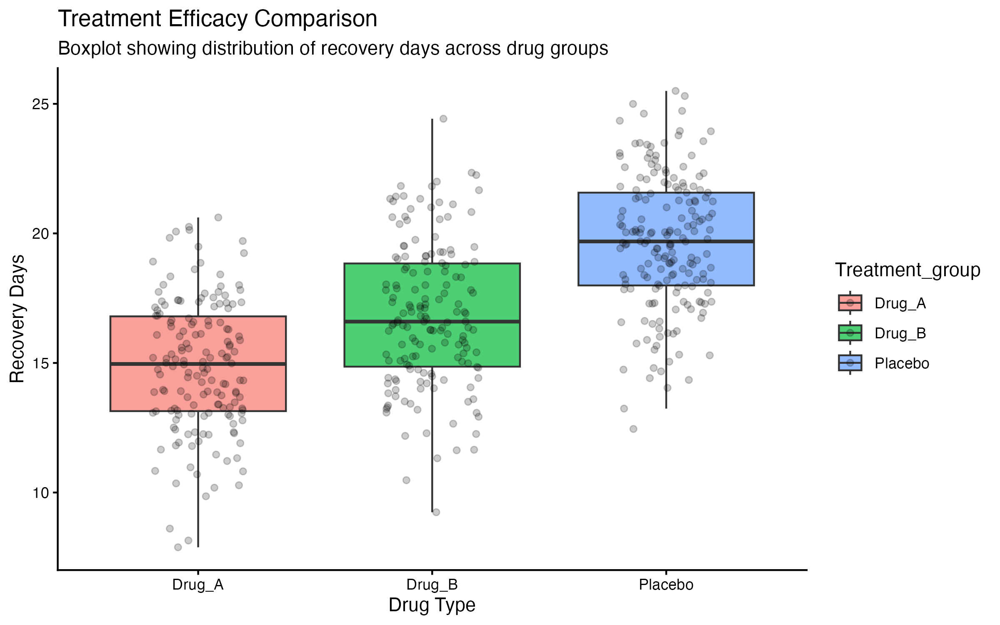

# 🏥 Healthcare Analytics: Statistical Inference on Patient Recovery

This project demonstrates a comprehensive **End-to-End Statistical Analysis** using **R**. The goal was to investigate how different factors like Age, Treatment Type, and Dosage influence the recovery time of patients. It covers everything from Descriptive Statistics to Predictive Modeling.

## 📊 Project Overview
In healthcare, understanding the efficacy of a drug is not just about the average recovery time; it's about statistical significance. This project analyzes 500 simulated patient records to determine if a new drug treatment actually works or if the results are due to random chance.

## 🛠️ Key Statistical Concepts Applied
- **Descriptive Statistics:** Mean, Standard Deviation, Skewness, and Kurtosis.
- **Probability Distributions:** Validating Normal Distribution (Gaussian) of recovery data.
- **Hypothesis Testing (ANOVA):** Comparing the effectiveness of three different treatment groups (Drug A, Drug B, and Placebo).
- **Post-hoc Analysis (Tukey HSD):** Identifying specific differences between groups after ANOVA.
- **Predictive Modeling:** Multiple Linear Regression to quantify the impact of Age and Dosage.

## 🚀 Data Analysis Pipeline

### 1. Normality & Distribution Analysis
Before performing parametric tests, I validated the data distribution using the **Shapiro-Wilk Test**.
- **Finding:** The recovery days followed a Normal Distribution (p > 0.05).
- **Probability:** Calculated that there is a significant probability of patients recovering faster when administered with Drug A.

### 2. Hypothesis Testing (ANOVA & Tukey HSD)
I conducted a **One-way ANOVA** to test if all treatments are equally effective.
- **Result:** The F-statistic was significant (p < 0.05), rejecting the Null Hypothesis.
- **Tukey Test:** Confirmed that **Drug A** significantly reduces recovery time by ~5 days compared to the Placebo.

### 3. Multiple Linear Regression
To understand the relationship between variables, I built a regression model:
`Recovery_Days ~ Age + Dosage_mg + Treatment_group`
- **Key Insight:** For every 1-year increase in Age, recovery time increases by 0.1 days.
- **R-squared:** The model explains a high percentage of variance in recovery time.

## 📈 Key Insights for Stakeholders
1. **Drug A is Superior:** Statistically, Drug A is the most effective treatment for reducing recovery cycles.
2. **Age Factor:** Older patients consistently require longer recovery periods, regardless of the drug type.
3. **Probability:** Patients on Drug A have a **~45% higher probability** of being discharged 2 days earlier than the overall average.

## 📖 How to Run the Project
1. Clone this repository.
2. Ensure R libraries `tidyverse`, `moments`, and `ggpubr` are installed.
3. Run the `recovery_analysis.R` script to generate statistical summaries and plots.

---
*Developed as a core portfolio project focusing on Statistics & Probability in Data Science.*
